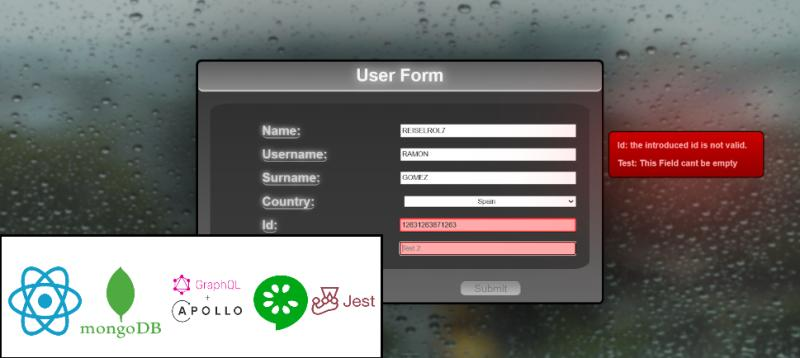

# DUAL-PRACTICE-Travelport


This repository contains the dual practice project "Travelport," developed using Spring Boot, MongoDB, React, TypeScript, and JavaScript. It also includes comprehensive tests to ensure code quality.

## Features

- **Spring Boot Backend**: RESTful APIs for managing travel data.
- **MongoDB Integration**: Efficient data storage and retrieval.
- **React Frontend**: Interactive and responsive user interface.
- **TypeScript and JavaScript**: Strong typing and dynamic functionalities.
- **Testing**: Unit and integration tests to ensure robustness.

## Screenshoots

### Calculator


### Tic Tac Toe


### Minesweeper 


### Form



## Installation

1. Clone the repository:
    ```bash
    git clone https://github.com/ReiselRol/DUAL-PRACTICE-Travelport.git
    ```
2. Navigate to the backend directory and install dependencies:
    ```bash
    cd backend
    mvn install
    ```
3. Start the Spring Boot application:
    ```bash
    mvn spring-boot:run
    ```
4. Navigate to the frontend directory and install dependencies:
    ```bash
    cd ../frontend
    npm install
    ```
5. Start the React application:
    ```bash
    npm start
    ```

## Usage

- **Backend API**: Interact with the API endpoints to manage travel data.
- **Frontend Interface**: Use the web interface to visualize and interact with the travel data.

## Project Structure

- **Backend**: Contains the Spring Boot application and MongoDB configurations.
- **Frontend**: Contains the React application with TypeScript and JavaScript code.
- **Tests**: Includes unit and integration tests for both backend and frontend.

## Contributing

Contributions are welcome! Please open an issue or submit a pull request to discuss any changes you would like to make.

## License

This project is licensed under the MIT License. See the [LICENSE](LICENSE) file for more details.

## Contact

- **Author**: Ramon Rios
- **GitHub**: [ReiselRol](https://github.com/ReiselRol)
